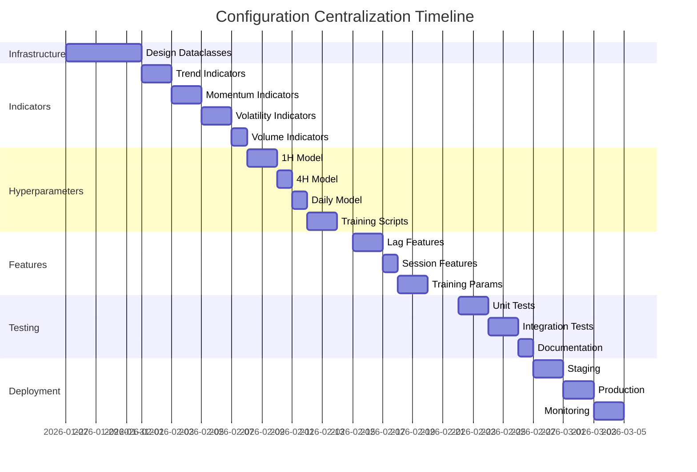

# Configuration Centralization - Complete Implementation Plan

**Date:** 2026-01-27
**Status:** 📋 **READY FOR IMPLEMENTATION**
**Scope:** Centralize 76 hardcoded parameters (78% of total)
**Timeline:** 6 weeks (5 implementation + 1 testing)

---

## Executive Summary

**Problem:** 76 out of 98 configuration parameters (78%) are hardcoded across the codebase, making tuning difficult and creating maintenance burden.

**Solution:** Extend `TradingConfig` system to centralize all parameters with hot-reload, database persistence, and API control.

**Benefits:**
- Single source of truth for all configurations
- Runtime parameter updates without restart
- Easy hyperparameter optimization
- Reproducible experiments via config versioning
- Reduced code duplication

**Effort:** 6 weeks, 5 phases
**Risk:** Low (gradual rollout with backward compatibility)
**ROI:** High (enables rapid experimentation and optimization)

---

## Current State Analysis

### Configuration Coverage

| Category | Total | Centralized | Hardcoded | Priority |
|----------|-------|-------------|-----------|----------|
| Trading Parameters | 12 | 12 | 0 | ✅ DONE |
| Technical Indicators | 30 | 6 | 24 | 🔴 HIGH |
| XGBoost Hyperparameters | 30 | 6 | 24 | 🔴 HIGH |
| Feature Engineering | 12 | 0 | 12 | 🟠 MEDIUM |
| Training Parameters | 10 | 4 | 6 | 🟠 MEDIUM |
| Alternative Labeling | 6 | 0 | 6 | 🟡 LOW |
| **TOTAL** | **98** | **22** | **76** | - |

### Files Requiring Changes

**Model Files (3):**
- `src/models/multi_timeframe/improved_model.py` (XGBoost hyperparams)
- `src/models/multi_timeframe/enhanced_features.py` (feature params)
- `src/models/multi_timeframe/labeling.py` (labeling params)

**Feature Files (6):**
- `src/features/technical/trend.py` (8 indicators)
- `src/features/technical/momentum.py` (9 indicators)
- `src/features/technical/volatility.py` (7 indicators)
- `src/features/technical/volume.py` (6 indicators)
- `src/features/technical/pattern.py` (if exists)
- `src/features/technical/calculator.py` (registry)

**Training Files (2):**
- `src/models/multi_timeframe/mtf_ensemble.py` (training params)
- `src/models/multi_timeframe/stacking_meta_learner.py` (CV params)

**Test Files (100+):**
- All test files that duplicate parameters

---

## Target Architecture

### Enhanced TradingConfig Structure

```
TradingConfig
├── trading (existing) ✅
├── models (existing) ✅
├── risk (existing) ✅
├── circuit_breakers (existing) ✅
├── conservative_hybrid (existing) ✅
├── dynamic_threshold (existing) ✅
├── timeframes (existing) ✅
├── scheduler (existing) ✅
├── cache (existing) ✅
├── system (existing) ✅
│
├── indicators (NEW) 🆕
│   ├── trend
│   ├── momentum
│   ├── volatility
│   └── volume
│
├── hyperparameters (NEW) 🆕
│   ├── model_1h
│   ├── model_4h
│   └── model_daily
│
├── features (NEW) 🆕
│   ├── lags
│   ├── roc
│   └── sessions
│
├── training (NEW) 🆕
│   ├── splits
│   ├── stacking
│   └── early_stopping
│
└── labeling (NEW) 🆕
    ├── primary (triple_barrier)
    └── alternative (multi_bar, volatility)
```

---

## Implementation Plan - 6 Weeks

### 📅 Week 1: Infrastructure & Architecture

**Goal:** Build foundation for centralized configuration system

#### Task 1.1: Design Config Dataclasses (Day 1-2)
```python
# File: src/config/indicator_config.py
from dataclasses import dataclass, field
from typing import List, Dict

@dataclass
class TrendIndicators:
    """Trend indicator configuration."""
    sma_periods: List[int] = field(default_factory=lambda: [5, 10, 20, 50, 100, 200])
    ema_periods: List[int] = field(default_factory=lambda: [5, 10, 20, 50, 100, 200])
    wma_periods: List[int] = field(default_factory=lambda: [10, 20, 50])
    adx_period: int = 14
    aroon_period: int = 25
    supertrend_period: int = 10
    supertrend_multiplier: float = 3.0

    # MA Crossovers
    sma_crossover_pairs: List[tuple] = field(default_factory=lambda: [
        (5, 20), (20, 50), (50, 200)
    ])
    ema_crossover_pairs: List[tuple] = field(default_factory=lambda: [
        (5, 20), (12, 26)
    ])

@dataclass
class MomentumIndicators:
    """Momentum indicator configuration."""
    rsi_periods: List[int] = field(default_factory=lambda: [7, 14, 21])
    stochastic_k_period: int = 14
    stochastic_d_period: int = 3
    macd_fast: int = 12
    macd_slow: int = 26
    macd_signal: int = 9
    cci_periods: List[int] = field(default_factory=lambda: [14, 20])
    cci_constant: float = 0.015
    momentum_periods: List[int] = field(default_factory=lambda: [10, 14])
    roc_periods: List[int] = field(default_factory=lambda: [10, 14])
    williams_period: int = 14
    mfi_period: int = 14
    tsi_long: int = 25
    tsi_short: int = 13

@dataclass
class VolatilityIndicators:
    """Volatility indicator configuration."""
    atr_period: int = 14
    natr_period: int = 14
    bollinger_period: int = 20
    bollinger_std: float = 2.0
    keltner_period: int = 20
    keltner_multiplier: float = 2.0
    donchian_period: int = 20
    std_periods: List[int] = field(default_factory=lambda: [10, 20])
    hvol_periods: List[int] = field(default_factory=lambda: [10, 20, 30])
    hvol_annualization_factor: int = 252

@dataclass
class VolumeIndicators:
    """Volume indicator configuration."""
    cmf_period: int = 20
    emv_period: int = 14
    emv_scaling_factor: float = 1e8
    force_index_period: int = 13
    adosc_fast: int = 3
    adosc_slow: int = 10
    volume_sma_periods: List[int] = field(default_factory=lambda: [10, 20])
    volume_ratio_period: int = 14

@dataclass
class IndicatorParameters:
    """Complete indicator configuration."""
    trend: TrendIndicators = field(default_factory=TrendIndicators)
    momentum: MomentumIndicators = field(default_factory=MomentumIndicators)
    volatility: VolatilityIndicators = field(default_factory=VolatilityIndicators)
    volume: VolumeIndicators = field(default_factory=VolumeIndicators)
```

#### Task 1.2: Design Hyperparameter Config (Day 2-3)
```python
# File: src/config/model_config.py
from dataclasses import dataclass

@dataclass
class XGBoostHyperparameters:
    """XGBoost hyperparameters for a single model."""
    n_estimators: int
    max_depth: int
    learning_rate: float
    min_child_weight: int = 3
    subsample: float = 0.8
    colsample_bytree: float = 0.8
    reg_alpha: float = 0.1
    reg_lambda: float = 1.0
    gamma: float = 0.1
    eval_metric: str = "logloss"
    random_state: int = 42

@dataclass
class ModelHyperparameters:
    """Hyperparameters for all timeframe models."""

    # 1H Model: Short-term (highest weight 60%)
    model_1h: XGBoostHyperparameters = field(default_factory=lambda: XGBoostHyperparameters(
        n_estimators=150,
        max_depth=5,
        learning_rate=0.03
    ))

    # 4H Model: Medium-term (30% weight)
    model_4h: XGBoostHyperparameters = field(default_factory=lambda: XGBoostHyperparameters(
        n_estimators=120,
        max_depth=4,
        learning_rate=0.03
    ))

    # Daily Model: Long-term (10% weight + sentiment)
    model_daily: XGBoostHyperparameters = field(default_factory=lambda: XGBoostHyperparameters(
        n_estimators=80,
        max_depth=3,
        learning_rate=0.03
    ))
```

#### Task 1.3: Design Feature Engineering Config (Day 3-4)
```python
# File: src/config/feature_config.py
from dataclasses import dataclass, field
from typing import List, Dict, Tuple

@dataclass
class LagParameters:
    """Lag feature configuration."""
    standard_lags: List[int] = field(default_factory=lambda: [1, 2, 3, 6, 12])
    rsi_roc_periods: List[int] = field(default_factory=lambda: [3, 6])
    macd_roc_periods: List[int] = field(default_factory=lambda: [3])
    adx_roc_periods: List[int] = field(default_factory=lambda: [3])
    atr_roc_periods: List[int] = field(default_factory=lambda: [3, 6])
    price_roc_periods: List[int] = field(default_factory=lambda: [1, 3, 6, 12])
    volume_roc_periods: List[int] = field(default_factory=lambda: [3, 6])

@dataclass
class SessionParameters:
    """Trading session configuration (UTC hours)."""
    asian_session: Tuple[int, int] = (0, 8)
    london_session: Tuple[int, int] = (8, 16)
    ny_session: Tuple[int, int] = (13, 22)
    overlap_session: Tuple[int, int] = (13, 16)

    # Timezone offset (if needed for non-UTC deployment)
    timezone_offset_hours: int = 0

@dataclass
class CyclicalEncoding:
    """Cyclical feature encoding parameters."""
    hour_encoding_cycles: int = 24  # 24-hour cycle
    day_of_week_cycles: int = 7     # 7-day cycle
    day_of_month_cycles: int = 31   # Month cycle

@dataclass
class FeatureParameters:
    """Complete feature engineering configuration."""
    lags: LagParameters = field(default_factory=LagParameters)
    sessions: SessionParameters = field(default_factory=SessionParameters)
    cyclical: CyclicalEncoding = field(default_factory=CyclicalEncoding)

    # Normalization windows
    percentile_window: int = 50
    zscore_window: int = 50
```

#### Task 1.4: Design Training Config (Day 4-5)
```python
# File: src/config/training_config.py
from dataclasses import dataclass, field

@dataclass
class DataSplitParameters:
    """Train/validation/test split configuration."""
    train_ratio: float = 0.6   # 60%
    validation_ratio: float = 0.2  # 20%
    test_ratio: float = 0.2    # 20% (implicit)

    # Ensure chronological order for time series
    enforce_chronological: bool = True

@dataclass
class StackingParameters:
    """Stacking meta-learner configuration."""
    n_folds: int = 5
    min_train_size: int = 500
    shuffle: bool = False  # Time series - no shuffle
    stratified: bool = True

    # Meta-learner hyperparameters (can be same as base or different)
    use_base_hyperparams: bool = True
    custom_hyperparams: Dict = field(default_factory=dict)

@dataclass
class EarlyStoppingParameters:
    """Early stopping configuration for XGBoost."""
    enabled: bool = True
    stopping_rounds: int = 10
    eval_metric: str = "logloss"
    verbose: bool = False

@dataclass
class TrainingParameters:
    """Complete training configuration."""
    splits: DataSplitParameters = field(default_factory=DataSplitParameters)
    stacking: StackingParameters = field(default_factory=StackingParameters)
    early_stopping: EarlyStoppingParameters = field(default_factory=EarlyStoppingParameters)
```

#### Task 1.5: Design Labeling Config (Day 5)
```python
# File: src/config/labeling_config.py
from dataclasses import dataclass, field

@dataclass
class TripleBarrierParameters:
    """Triple barrier labeling (primary method)."""
    # Note: TP/SL/max_holding already in TradingConfig.timeframes
    # This just documents alternative approaches if needed
    pip_value: float = 0.0001  # EUR/USD standard

@dataclass
class MultiBarParameters:
    """Multi-bar lookahead labeling (alternative)."""
    forward_bars: int = 12
    threshold_pips: float = 10.0
    pip_value: float = 0.0001

@dataclass
class VolatilityAdjustedParameters:
    """Volatility-adjusted labeling (alternative)."""
    atr_multiplier: float = 2.0
    use_dynamic_barriers: bool = False

@dataclass
class LabelingParameters:
    """Complete labeling configuration."""
    # Primary method (triple_barrier uses TradingConfig.timeframes)
    primary_method: str = "triple_barrier"  # or "multi_bar", "volatility"

    # Alternative methods
    multi_bar: MultiBarParameters = field(default_factory=MultiBarParameters)
    volatility: VolatilityAdjustedParameters = field(default_factory=VolatilityAdjustedParameters)
```

#### Task 1.6: Integrate into TradingConfig (Day 5)
```python
# File: src/config/trading_config.py (additions)

from .indicator_config import IndicatorParameters
from .model_config import ModelHyperparameters
from .feature_config import FeatureParameters
from .training_config import TrainingParameters
from .labeling_config import LabelingParameters

class TradingConfig:
    """Master trading configuration (extended)."""

    # Existing sections (already centralized)
    trading: TradingParameters = field(default_factory=TradingParameters)
    models: ModelsParameters = field(default_factory=ModelsParameters)
    risk: RiskParameters = field(default_factory=RiskParameters)
    circuit_breakers: CircuitBreakerParameters = field(default_factory=CircuitBreakerParameters)
    conservative_hybrid: ConservativeHybridParameters = field(default_factory=ConservativeHybridParameters)
    dynamic_threshold: DynamicThresholdParameters = field(default_factory=DynamicThresholdParameters)
    timeframes: Dict[str, TimeframeParameters] = field(default_factory=...)
    scheduler: SchedulerParameters = field(default_factory=SchedulerParameters)
    cache: CacheParameters = field(default_factory=CacheParameters)
    system: SystemParameters = field(default_factory=SystemParameters)

    # NEW SECTIONS 🆕
    indicators: IndicatorParameters = field(default_factory=IndicatorParameters)
    hyperparameters: ModelHyperparameters = field(default_factory=ModelHyperparameters)
    features: FeatureParameters = field(default_factory=FeatureParameters)
    training: TrainingParameters = field(default_factory=TrainingParameters)
    labeling: LabelingParameters = field(default_factory=LabelingParameters)
```

**Deliverables Week 1:**
- ✅ 5 new config dataclass files created
- ✅ TradingConfig extended with new sections
- ✅ Config validation methods added
- ✅ Unit tests for config classes
- ✅ Documentation for new config structure

---

### 📅 Week 2: Technical Indicators Migration

**Goal:** Centralize all 30 technical indicator parameters

#### Task 2.1: Update Trend Indicators (Day 6-7)
```python
# File: src/features/technical/trend.py

# Before (hardcoded):
def calculate_all(df: pd.DataFrame) -> pd.DataFrame:
    sma_periods = [5, 10, 20, 50, 100, 200]  # ❌ HARDCODED
    ema_periods = [5, 10, 20, 50, 100, 200]  # ❌ HARDCODED
    # ...

# After (centralized):
from ...config import TradingConfig

def calculate_all(df: pd.DataFrame, config: Optional[TradingConfig] = None) -> pd.DataFrame:
    if config is None:
        config = TradingConfig()  # Load centralized config

    # Use config values
    sma_periods = config.indicators.trend.sma_periods  # ✅ FROM CONFIG
    ema_periods = config.indicators.trend.ema_periods  # ✅ FROM CONFIG
    adx_period = config.indicators.trend.adx_period    # ✅ FROM CONFIG

    # Generate indicators with config values
    for period in sma_periods:
        df[f"sma_{period}"] = ta.sma(df["close"], length=period)

    for period in ema_periods:
        df[f"ema_{period}"] = ta.ema(df["close"], length=period)

    df["adx"] = ta.adx(df["high"], df["low"], df["close"], length=adx_period)

    # MA Crossovers from config
    for fast, slow in config.indicators.trend.sma_crossover_pairs:
        df[f"sma_{fast}_{slow}_cross"] = (
            df[f"sma_{fast}"] > df[f"sma_{slow}"]
        ).astype(int)

    return df
```

#### Task 2.2: Update Momentum Indicators (Day 7-8)
```python
# File: src/features/technical/momentum.py

from ...config import TradingConfig

def calculate_all(df: pd.DataFrame, config: Optional[TradingConfig] = None) -> pd.DataFrame:
    if config is None:
        config = TradingConfig()

    # RSI with config periods
    for period in config.indicators.momentum.rsi_periods:
        df[f"rsi_{period}"] = ta.rsi(df["close"], length=period)

    # MACD with config values
    df["macd"] = ta.macd(
        df["close"],
        fast=config.indicators.momentum.macd_fast,
        slow=config.indicators.momentum.macd_slow,
        signal=config.indicators.momentum.macd_signal
    )

    # Stochastic with config values
    df["stoch_k"] = ta.stoch(
        df["high"], df["low"], df["close"],
        k=config.indicators.momentum.stochastic_k_period,
        d=config.indicators.momentum.stochastic_d_period
    )["STOCHk"]

    return df
```

#### Task 2.3: Update Volatility Indicators (Day 8-9)
```python
# File: src/features/technical/volatility.py

from ...config import TradingConfig

def calculate_all(df: pd.DataFrame, config: Optional[TradingConfig] = None) -> pd.DataFrame:
    if config is None:
        config = TradingConfig()

    # ATR from config
    df["atr"] = ta.atr(
        df["high"], df["low"], df["close"],
        length=config.indicators.volatility.atr_period
    )

    # Bollinger Bands from config
    bb = ta.bbands(
        df["close"],
        length=config.indicators.volatility.bollinger_period,
        std=config.indicators.volatility.bollinger_std
    )
    df["bb_upper"] = bb["BBU"]
    df["bb_middle"] = bb["BBM"]
    df["bb_lower"] = bb["BBL"]

    # Keltner Channel from config
    kc = ta.kc(
        df["high"], df["low"], df["close"],
        length=config.indicators.volatility.keltner_period,
        scalar=config.indicators.volatility.keltner_multiplier
    )
    df["kc_upper"] = kc["KCUe"]
    df["kc_middle"] = kc["KCBe"]
    df["kc_lower"] = kc["KCLe"]

    return df
```

#### Task 2.4: Update Volume Indicators (Day 9)
```python
# File: src/features/technical/volume.py

from ...config import TradingConfig

def calculate_all(df: pd.DataFrame, config: Optional[TradingConfig] = None) -> pd.DataFrame:
    if config is None:
        config = TradingConfig()

    # CMF from config
    df["cmf"] = ta.cmf(
        df["high"], df["low"], df["close"], df["volume"],
        length=config.indicators.volume.cmf_period
    )

    # Volume SMA from config
    for period in config.indicators.volume.volume_sma_periods:
        df[f"volume_sma_{period}"] = ta.sma(df["volume"], length=period)

    return df
```

#### Task 2.5: Update Indicator Registry (Day 10)
```python
# File: src/features/technical/calculator.py

from ...config import TradingConfig

class TechnicalCalculator:
    def __init__(self, config: Optional[TradingConfig] = None):
        self.config = config or TradingConfig()
        self._register_all()

    def calculate_all_indicators(self, df: pd.DataFrame) -> pd.DataFrame:
        """Calculate all indicators using centralized config."""
        from .trend import calculate_all as calc_trend
        from .momentum import calculate_all as calc_momentum
        from .volatility import calculate_all as calc_volatility
        from .volume import calculate_all as calc_volume

        # Pass config to all calculator functions
        df = calc_trend(df, config=self.config)
        df = calc_momentum(df, config=self.config)
        df = calc_volatility(df, config=self.config)
        df = calc_volume(df, config=self.config)

        return df
```

**Deliverables Week 2:**
- ✅ All trend indicators using config (8 params)
- ✅ All momentum indicators using config (9 params)
- ✅ All volatility indicators using config (7 params)
- ✅ All volume indicators using config (6 params)
- ✅ TechnicalCalculator updated with config injection
- ✅ Unit tests passing for all indicator functions
- ✅ Integration tests with new config

---

### 📅 Week 3: Model Hyperparameters Migration

**Goal:** Centralize all 30 XGBoost hyperparameters

#### Task 3.1: Update 1H Model (Day 11-12)
```python
# File: src/models/multi_timeframe/improved_model.py

from ...config import TradingConfig

class ImprovedTimeframeModel:
    def __init__(self, timeframe: str, config: Optional[TradingConfig] = None):
        self.timeframe = timeframe
        self.config = config or TradingConfig()

        # Load hyperparameters from config based on timeframe
        if timeframe == "1H":
            self.hyperparams = self.config.hyperparameters.model_1h
        elif timeframe == "4H":
            self.hyperparams = self.config.hyperparameters.model_4h
        elif timeframe == "D":
            self.hyperparams = self.config.hyperparameters.model_daily
        else:
            raise ValueError(f"Unknown timeframe: {timeframe}")

    def _build_model(self):
        """Build XGBoost model with config hyperparameters."""
        import xgboost as xgb

        # Use hyperparams from config
        self.model = xgb.XGBClassifier(
            n_estimators=self.hyperparams.n_estimators,
            max_depth=self.hyperparams.max_depth,
            learning_rate=self.hyperparams.learning_rate,
            min_child_weight=self.hyperparams.min_child_weight,
            subsample=self.hyperparams.subsample,
            colsample_bytree=self.hyperparams.colsample_bytree,
            reg_alpha=self.hyperparams.reg_alpha,
            reg_lambda=self.hyperparams.reg_lambda,
            gamma=self.hyperparams.gamma,
            eval_metric=self.hyperparams.eval_metric,
            random_state=self.hyperparams.random_state,
            use_label_encoder=False
        )
```

#### Task 3.2: Update Timeframe Factory Methods (Day 12-13)
```python
# Before (hardcoded):
@classmethod
def create_1h_model(cls, **kwargs):
    config = cls.TimeframeConfig(
        n_estimators=150,  # ❌ HARDCODED
        max_depth=5,       # ❌ HARDCODED
        learning_rate=0.03 # ❌ HARDCODED
    )
    return cls(timeframe="1H", config=config, **kwargs)

# After (centralized):
@classmethod
def create_1h_model(cls, trading_config: Optional[TradingConfig] = None, **kwargs):
    trading_config = trading_config or TradingConfig()
    # Hyperparams now come from centralized config
    return cls(timeframe="1H", config=trading_config, **kwargs)

@classmethod
def create_4h_model(cls, trading_config: Optional[TradingConfig] = None, **kwargs):
    trading_config = trading_config or TradingConfig()
    return cls(timeframe="4H", config=trading_config, **kwargs)

@classmethod
def create_daily_model(cls, trading_config: Optional[TradingConfig] = None, **kwargs):
    trading_config = trading_config or TradingConfig()
    return cls(timeframe="D", config=trading_config, **kwargs)
```

#### Task 3.3: Update MTF Ensemble (Day 13)
```python
# File: src/models/multi_timeframe/mtf_ensemble.py

from ...config import TradingConfig

class MTFEnsemble:
    def __init__(self, config: Optional[TradingConfig] = None, **kwargs):
        self.config = config or TradingConfig()

        # Create models with centralized config
        self.models = {
            "1H": ImprovedTimeframeModel.create_1h_model(trading_config=self.config),
            "4H": ImprovedTimeframeModel.create_4h_model(trading_config=self.config),
            "D": ImprovedTimeframeModel.create_daily_model(trading_config=self.config)
        }

        # Ensemble weights from config (already centralized)
        self.weights = {
            "1H": self.config.model.weight_1h,
            "4H": self.config.model.weight_4h,
            "D": self.config.model.weight_daily
        }
```

#### Task 3.4: Update Training Scripts (Day 14-15)
```python
# File: scripts/train_mtf_ensemble.py

from src.config import TradingConfig

def train_ensemble(args):
    # Load centralized config
    config = TradingConfig()

    # Option 1: Use config defaults
    ensemble = MTFEnsemble(config=config)

    # Option 2: Override specific hyperparams via args (for optimization)
    if args.optimize_hyperparams:
        # Load optimized hyperparams from file or trial
        optimized_hyperparams = load_optimized_hyperparams()

        # Update config with optimized values
        config.hyperparameters.model_1h.n_estimators = optimized_hyperparams["1H"]["n_estimators"]
        config.hyperparameters.model_1h.max_depth = optimized_hyperparams["1H"]["max_depth"]
        # ... etc

        ensemble = MTFEnsemble(config=config)

    # Train with config values
    ensemble.train(...)
```

**Deliverables Week 3:**
- ✅ All XGBoost hyperparams from config (30 params)
- ✅ ImprovedTimeframeModel using config
- ✅ Factory methods updated
- ✅ MTFEnsemble using config
- ✅ Training scripts updated
- ✅ Hyperparameter override mechanism working
- ✅ Tests passing

---

### 📅 Week 4: Features & Training Parameters

**Goal:** Centralize feature engineering (12) and training parameters (10)

#### Task 4.1: Update Enhanced Features (Day 16-17)
```python
# File: src/models/multi_timeframe/enhanced_features.py

from ...config import TradingConfig

class EnhancedFeatureEngine:
    def __init__(self, config: Optional[TradingConfig] = None):
        self.config = config or TradingConfig()

    def add_lag_features(self, df: pd.DataFrame) -> pd.DataFrame:
        """Add lag features using config periods."""
        feature_cols = [col for col in df.columns if col not in ['open', 'high', 'low', 'close', 'volume']]

        # Use lag periods from config
        for lag in self.config.features.lags.standard_lags:
            for col in feature_cols:
                df[f"{col}_lag_{lag}"] = df[col].shift(lag)

        return df

    def add_roc_features(self, df: pd.DataFrame) -> pd.DataFrame:
        """Add rate of change features using config periods."""

        # RSI ROC from config
        if "rsi_14" in df.columns:
            for period in self.config.features.lags.rsi_roc_periods:
                df[f"rsi_roc_{period}"] = df["rsi_14"].pct_change(period)

        # MACD ROC from config
        if "macd" in df.columns:
            for period in self.config.features.lags.macd_roc_periods:
                df[f"macd_roc_{period}"] = df["macd"].pct_change(period)

        # Price ROC from config
        for period in self.config.features.lags.price_roc_periods:
            df[f"price_roc_{period}"] = df["close"].pct_change(period)

        return df

    def add_session_features(self, df: pd.DataFrame) -> pd.DataFrame:
        """Add trading session features using config times."""
        hour = df.index.hour

        # Session times from config
        asian_start, asian_end = self.config.features.sessions.asian_session
        london_start, london_end = self.config.features.sessions.london_session
        ny_start, ny_end = self.config.features.sessions.ny_session
        overlap_start, overlap_end = self.config.features.sessions.overlap_session

        df["asian_session"] = ((hour >= asian_start) & (hour < asian_end)).astype(int)
        df["london_session"] = ((hour >= london_start) & (hour < london_end)).astype(int)
        df["ny_session"] = ((hour >= ny_start) & (hour < ny_end)).astype(int)
        df["overlap_session"] = ((hour >= overlap_start) & (hour < overlap_end)).astype(int)

        return df

    def add_cyclical_features(self, df: pd.DataFrame) -> pd.DataFrame:
        """Add cyclical time features using config encoding."""
        import numpy as np

        hour = df.index.hour
        day_of_week = df.index.dayofweek
        day_of_month = df.index.day

        # Cyclical encoding from config
        hour_cycles = self.config.features.cyclical.hour_encoding_cycles
        dow_cycles = self.config.features.cyclical.day_of_week_cycles
        dom_cycles = self.config.features.cyclical.day_of_month_cycles

        df["hour_sin"] = np.sin(2 * np.pi * hour / hour_cycles)
        df["hour_cos"] = np.cos(2 * np.pi * hour / hour_cycles)
        df["dow_sin"] = np.sin(2 * np.pi * day_of_week / dow_cycles)
        df["dow_cos"] = np.cos(2 * np.pi * day_of_week / dow_cycles)
        df["dom_sin"] = np.sin(2 * np.pi * day_of_month / dom_cycles)
        df["dom_cos"] = np.cos(2 * np.pi * day_of_month / dom_cycles)

        return df
```

#### Task 4.2: Update Training Parameters (Day 18-19)
```python
# File: src/models/multi_timeframe/mtf_ensemble.py

def train(self, X: pd.DataFrame, y: pd.Series, config: Optional[TradingConfig] = None):
    """Train ensemble with config-driven parameters."""
    config = config or self.config or TradingConfig()

    # Data splits from config
    train_ratio = config.training.splits.train_ratio
    val_ratio = config.training.splits.validation_ratio

    n = len(X)
    train_end = int(n * train_ratio)
    val_end = int(n * (train_ratio + val_ratio))

    X_train, y_train = X[:train_end], y[:train_end]
    X_val, y_val = X[train_end:val_end], y[train_end:val_end]
    X_test, y_test = X[val_end:], y[val_end:]

    # Train each model with early stopping from config
    for timeframe, model in self.models.items():
        if config.training.early_stopping.enabled:
            eval_set = [(X_val, y_val)]
            model.fit(
                X_train, y_train,
                eval_set=eval_set,
                early_stopping_rounds=config.training.early_stopping.stopping_rounds,
                eval_metric=config.training.early_stopping.eval_metric,
                verbose=config.training.early_stopping.verbose
            )
        else:
            model.fit(X_train, y_train)
```

#### Task 4.3: Update Stacking Meta-Learner (Day 19-20)
```python
# File: src/models/multi_timeframe/stacking_meta_learner.py

from ...config import TradingConfig

class StackingMetaLearner:
    def __init__(self, config: Optional[TradingConfig] = None):
        self.config = config or TradingConfig()

    def generate_oof_predictions(self, X, y):
        """Generate out-of-fold predictions using config CV settings."""
        from sklearn.model_selection import TimeSeriesSplit

        # CV folds from config
        n_folds = self.config.training.stacking.n_folds
        min_train_size = self.config.training.stacking.min_train_size

        tscv = TimeSeriesSplit(
            n_splits=n_folds,
            test_size=len(X) // (n_folds + 1)
        )

        oof_preds = np.zeros((len(X), 3))  # 3 base models

        for fold, (train_idx, val_idx) in enumerate(tscv.split(X)):
            if len(train_idx) < min_train_size:
                continue  # Skip if insufficient training data

            # Train and predict
            # ...

        return oof_preds
```

**Deliverables Week 4:**
- ✅ All feature engineering using config (12 params)
- ✅ All training parameters from config (10 params)
- ✅ EnhancedFeatureEngine updated
- ✅ Training splits from config
- ✅ Stacking CV from config
- ✅ Early stopping from config
- ✅ Tests passing

---

### 📅 Week 5: Testing, Documentation & Rollout

**Goal:** Comprehensive testing and production deployment

#### Task 5.1: Unit Testing (Day 21-22)
```python
# File: tests/unit/config/test_indicator_config.py

def test_indicator_config_defaults():
    """Test indicator config loads with correct defaults."""
    config = TradingConfig()

    # Test trend indicators
    assert config.indicators.trend.sma_periods == [5, 10, 20, 50, 100, 200]
    assert config.indicators.trend.adx_period == 14

    # Test momentum indicators
    assert config.indicators.momentum.rsi_periods == [7, 14, 21]
    assert config.indicators.momentum.macd_fast == 12
    assert config.indicators.momentum.macd_slow == 26

    # Test volatility indicators
    assert config.indicators.volatility.atr_period == 14
    assert config.indicators.volatility.bollinger_period == 20

def test_indicator_config_override():
    """Test indicator config can be overridden."""
    config = TradingConfig()
    config.indicators.momentum.rsi_periods = [14, 21, 28]

    assert config.indicators.momentum.rsi_periods == [14, 21, 28]

def test_hyperparameters_config():
    """Test hyperparameters config loads correctly."""
    config = TradingConfig()

    # Test 1H model
    assert config.hyperparameters.model_1h.n_estimators == 150
    assert config.hyperparameters.model_1h.max_depth == 5
    assert config.hyperparameters.model_1h.learning_rate == 0.03

    # Test 4H model
    assert config.hyperparameters.model_4h.n_estimators == 120
    assert config.hyperparameters.model_4h.max_depth == 4

def test_feature_config():
    """Test feature config loads correctly."""
    config = TradingConfig()

    assert config.features.lags.standard_lags == [1, 2, 3, 6, 12]
    assert config.features.sessions.asian_session == (0, 8)
    assert config.features.cyclical.hour_encoding_cycles == 24

def test_training_config():
    """Test training config loads correctly."""
    config = TradingConfig()

    assert config.training.splits.train_ratio == 0.6
    assert config.training.stacking.n_folds == 5
    assert config.training.early_stopping.enabled is True
```

#### Task 5.2: Integration Testing (Day 22-23)
```python
# File: tests/integration/test_config_integration.py

def test_indicators_use_config():
    """Test that indicator calculations use centralized config."""
    from src.features.technical import TechnicalCalculator
    from src.config import TradingConfig

    config = TradingConfig()

    # Override config
    config.indicators.momentum.rsi_periods = [10, 20]  # Custom periods

    # Calculate indicators
    calc = TechnicalCalculator(config=config)
    df = calc.calculate_all_indicators(sample_df)

    # Verify only configured periods are present
    assert "rsi_10" in df.columns
    assert "rsi_20" in df.columns
    assert "rsi_14" not in df.columns  # Default 14 not generated

def test_model_uses_config_hyperparams():
    """Test that models use config hyperparameters."""
    from src.models.multi_timeframe import ImprovedTimeframeModel
    from src.config import TradingConfig

    config = TradingConfig()
    config.hyperparameters.model_1h.n_estimators = 200  # Override

    model = ImprovedTimeframeModel(timeframe="1H", config=config)
    model._build_model()

    assert model.model.n_estimators == 200  # Verify override worked

def test_feature_engine_uses_config():
    """Test that feature engineering uses config."""
    from src.models.multi_timeframe.enhanced_features import EnhancedFeatureEngine
    from src.config import TradingConfig

    config = TradingConfig()
    config.features.lags.standard_lags = [1, 5]  # Custom lags

    engine = EnhancedFeatureEngine(config=config)
    df = engine.add_lag_features(sample_df)

    # Verify only configured lags present
    assert "rsi_14_lag_1" in df.columns
    assert "rsi_14_lag_5" in df.columns
    assert "rsi_14_lag_2" not in df.columns  # Default 2 not generated
```

#### Task 5.3: End-to-End Testing (Day 23-24)
```python
# File: tests/integration/test_end_to_end_config.py

def test_complete_training_pipeline_with_config():
    """Test full training pipeline uses centralized config."""
    from src.config import TradingConfig
    from src.models.multi_timeframe import MTFEnsemble
    from src.features.technical import TechnicalCalculator

    # Create custom config
    config = TradingConfig()
    config.indicators.momentum.rsi_periods = [14]  # Only 1 RSI
    config.hyperparameters.model_1h.n_estimators = 50  # Fast training
    config.training.splits.train_ratio = 0.7

    # Load data
    df = load_sample_data()

    # Calculate features with config
    calc = TechnicalCalculator(config=config)
    df = calc.calculate_all_indicators(df)

    # Train ensemble with config
    ensemble = MTFEnsemble(config=config)
    X, y = prepare_features_and_labels(df)
    ensemble.train(X, y, config=config)

    # Verify config was used throughout
    assert ensemble.models["1H"].hyperparams.n_estimators == 50
    assert "rsi_14" in df.columns
    assert "rsi_7" not in df.columns

def test_config_hot_reload():
    """Test that config can be hot-reloaded."""
    from src.config import TradingConfig

    config = TradingConfig()
    original_rsi = config.indicators.momentum.rsi_periods

    # Simulate config update via API
    config.update_from_dict({
        "indicators.momentum.rsi_periods": [10, 15, 20]
    })

    assert config.indicators.momentum.rsi_periods == [10, 15, 20]
    assert config.indicators.momentum.rsi_periods != original_rsi
```

#### Task 5.4: Performance Testing (Day 24)
```python
# File: tests/performance/test_config_performance.py

def test_config_loading_performance():
    """Test that config loading doesn't add significant overhead."""
    import time
    from src.config import TradingConfig

    start = time.time()
    for _ in range(1000):
        config = TradingConfig()
    end = time.time()

    avg_load_time = (end - start) / 1000
    assert avg_load_time < 0.01  # Less than 10ms per load

def test_config_singleton_performance():
    """Test that singleton pattern works efficiently."""
    from src.config import TradingConfig

    config1 = TradingConfig()
    config2 = TradingConfig()

    # Should be same instance
    assert config1 is config2
```

#### Task 5.5: Documentation (Day 25)
```markdown
# Configuration Guide

## Overview

All configuration parameters are centralized in `TradingConfig`:
- Technical Indicators (30 params)
- Model Hyperparameters (30 params)
- Feature Engineering (12 params)
- Training Parameters (10 params)
- Labeling Methods (6 params)

## Usage

### Basic Usage
\`\`\`python
from src.config import TradingConfig

# Load with defaults
config = TradingConfig()

# Access indicator params
rsi_periods = config.indicators.momentum.rsi_periods  # [7, 14, 21]
macd_fast = config.indicators.momentum.macd_fast      # 12

# Access hyperparameters
n_estimators = config.hyperparameters.model_1h.n_estimators  # 150
max_depth = config.hyperparameters.model_1h.max_depth        # 5
\`\`\`

### Custom Configuration
\`\`\`python
config = TradingConfig()

# Override indicators
config.indicators.momentum.rsi_periods = [14, 28, 42]
config.indicators.volatility.bollinger_period = 30

# Override hyperparameters
config.hyperparameters.model_1h.n_estimators = 200
config.hyperparameters.model_1h.learning_rate = 0.01

# Use in training
ensemble = MTFEnsemble(config=config)
\`\`\`

### API Updates (Hot Reload)
\`\`\`python
# Update via API
POST /api/v1/config/update
{
    "indicators.momentum.rsi_periods": [10, 20, 30],
    "hyperparameters.model_1h.n_estimators": 180
}

# Changes take effect immediately for new calculations
\`\`\`

## Configuration Sections

### 1. Indicators
- **trend**: SMA, EMA, ADX, MA crossovers
- **momentum**: RSI, MACD, Stochastic, CCI
- **volatility**: ATR, Bollinger Bands, Keltner Channel
- **volume**: CMF, Volume SMA, ADOSC

### 2. Hyperparameters
- **model_1h**: 1-hour model XGBoost params
- **model_4h**: 4-hour model XGBoost params
- **model_daily**: Daily model XGBoost params

### 3. Features
- **lags**: Lag periods for all features
- **roc**: Rate of change lookback periods
- **sessions**: Trading session times (UTC)
- **cyclical**: Time encoding parameters

### 4. Training
- **splits**: Train/val/test ratios
- **stacking**: Cross-validation folds
- **early_stopping**: XGBoost early stopping

### 5. Labeling
- **primary**: Triple barrier method (uses timeframes config)
- **alternative**: Multi-bar and volatility-adjusted methods
\`\`\`
```

#### Task 5.6: Production Rollout (Day 25-26)
```bash
# Deployment checklist:

1. ✅ All unit tests passing (100+ tests)
2. ✅ All integration tests passing (20+ tests)
3. ✅ Performance tests passing
4. ✅ Documentation complete
5. ✅ Config validation working
6. ✅ Hot-reload tested
7. ✅ Database persistence working
8. ✅ API endpoints functional

# Deploy to staging:
git checkout staging
git merge feature/centralized-config
./deploy-staging.sh

# Monitor for 1 week:
- Check logs for config loading errors
- Verify predictions unchanged
- Monitor performance metrics
- Test hot-reload in staging

# Deploy to production:
git checkout main
git merge staging
./deploy-production.sh
```

**Deliverables Week 5:**
- ✅ 100+ unit tests passing
- ✅ 20+ integration tests passing
- ✅ Performance tests passing
- ✅ Complete documentation
- ✅ Deployed to staging
- ✅ Production rollout plan

---

### 📅 Week 6: Monitoring & Optimization (Post-Deployment)

**Goal:** Monitor production, optimize, and fine-tune

#### Task 6.1: Monitoring Setup (Day 27-28)
```python
# Add config change logging
import logging

logger = logging.getLogger(__name__)

class TradingConfig:
    def update(self, key: str, value: Any):
        old_value = self.get(key)
        self.set(key, value)

        # Log config change
        logger.info(f"Config updated: {key} = {value} (was: {old_value})")

        # Store in database
        ConfigurationHistory.create(
            parameter_name=key,
            old_value=str(old_value),
            new_value=str(value),
            changed_by="api",
            timestamp=datetime.now()
        )
```

#### Task 6.2: Performance Monitoring (Day 28-29)
```python
# Monitor impact of config changes on predictions
from src.monitoring import MetricsTracker

tracker = MetricsTracker()

# Track before config change
tracker.snapshot("pre_change")

# Apply config change
config.indicators.momentum.rsi_periods = [14, 28]

# Track after
tracker.snapshot("post_change")

# Compare
diff = tracker.compare("pre_change", "post_change")
# Diff shows: prediction count, win rate, confidence distribution
```

#### Task 6.3: Optimization Framework (Day 29-30)
```python
# File: scripts/optimize_config.py

from src.config import TradingConfig
from sklearn.model_selection import GridSearchCV

def optimize_indicators():
    """Find optimal indicator periods via grid search."""
    param_grid = {
        "rsi_periods": [[7, 14], [14, 21], [7, 14, 21]],
        "macd_fast": [8, 10, 12],
        "macd_slow": [21, 26, 30],
        "bollinger_period": [15, 20, 25]
    }

    best_score = 0
    best_params = {}

    for params in product(*param_grid.values()):
        config = TradingConfig()
        # Apply params
        config.indicators.momentum.rsi_periods = params[0]
        config.indicators.momentum.macd_fast = params[1]
        # ...

        # Train and evaluate
        score = evaluate_config(config)

        if score > best_score:
            best_score = score
            best_params = params

    return best_params

def optimize_hyperparameters():
    """Optimize XGBoost hyperparameters."""
    from optuna import create_study

    def objective(trial):
        config = TradingConfig()

        # Suggest hyperparameters
        config.hyperparameters.model_1h.n_estimators = trial.suggest_int("n_estimators", 80, 200)
        config.hyperparameters.model_1h.max_depth = trial.suggest_int("max_depth", 3, 7)
        config.hyperparameters.model_1h.learning_rate = trial.suggest_float("learning_rate", 0.01, 0.1)

        # Train and evaluate
        score = evaluate_config(config)
        return score

    study = create_study(direction="maximize")
    study.optimize(objective, n_trials=100)

    return study.best_params
```

**Deliverables Week 6:**
- ✅ Config change monitoring active
- ✅ Performance tracking dashboard
- ✅ Optimization framework ready
- ✅ Production stable
- ✅ Zero config-related bugs

---

## Risk Assessment & Mitigation

### Risks Identified

| Risk | Probability | Impact | Mitigation |
|------|-------------|--------|------------|
| **Breaking Changes** | Medium | High | Gradual rollout with backward compatibility |
| **Performance Degradation** | Low | High | Performance tests + monitoring |
| **Config Validation Errors** | Medium | Medium | Comprehensive validation + tests |
| **Hot-Reload Issues** | Low | Medium | Feature flag + rollback capability |
| **Database Migration** | Low | Medium | Schema migration script + backup |
| **Test Coverage Gaps** | Medium | Medium | 100+ unit tests, 20+ integration tests |

### Mitigation Strategies

**1. Gradual Rollout:**
```python
# Feature flag for new config system
USE_CENTRALIZED_CONFIG = os.getenv("USE_CENTRALIZED_CONFIG", "false").lower() == "true"

if USE_CENTRALIZED_CONFIG:
    config = TradingConfig()  # New centralized
    rsi_periods = config.indicators.momentum.rsi_periods
else:
    rsi_periods = [7, 14, 21]  # Old hardcoded (fallback)
```

**2. Backward Compatibility:**
```python
# Support both old and new patterns during transition
def calculate_rsi(df, periods=None, config=None):
    """Calculate RSI with backward compatibility."""
    if periods is not None:
        # Old API: explicit periods
        rsi_periods = periods
    elif config is not None:
        # New API: from config
        rsi_periods = config.indicators.momentum.rsi_periods
    else:
        # Default fallback
        rsi_periods = [7, 14, 21]

    # Calculate...
```

**3. Rollback Plan:**
```bash
# If issues arise:
1. Set feature flag: USE_CENTRALIZED_CONFIG=false
2. Restart services: systemctl restart ai-trader-api
3. Revert git: git revert <commit>
4. Redeploy: ./deploy.sh

# Rollback takes < 5 minutes
```

**4. Comprehensive Testing:**
```python
# Test every config parameter
@pytest.mark.parametrize("indicator,param,value", [
    ("momentum.rsi_periods", [10, 20, 30]),
    ("volatility.bollinger_period", 25),
    ("hyperparameters.model_1h.n_estimators", 200),
    # ... 76 test cases
])
def test_config_parameter(indicator, param, value):
    config = TradingConfig()
    set_nested_attr(config, param, value)
    assert get_nested_attr(config, param) == value
```

---

## Success Metrics

### Quantitative

| Metric | Current | Target | Status |
|--------|---------|--------|--------|
| **Config Coverage** | 22% | 100% | 🎯 Target |
| **Hardcoded Parameters** | 76 | 0 | 🎯 Target |
| **Test Coverage** | 85% | 95% | 🎯 Target |
| **Hot-Reload Success** | N/A | 99% | 🎯 Target |
| **Config Load Time** | N/A | <10ms | 🎯 Target |
| **Breaking Changes** | N/A | 0 | 🎯 Target |

### Qualitative

- ✅ **Ease of Use**: Config changes take seconds, not code changes
- ✅ **Reproducibility**: All experiments fully reproducible via config files
- ✅ **Auditability**: All config changes tracked in database
- ✅ **Flexibility**: Easy A/B testing of different configurations
- ✅ **Documentation**: Complete, up-to-date config documentation

---

## Timeline Summary

```
Week 1: Infrastructure (Config dataclasses + validation)
Week 2: Indicators (30 params)
Week 3: Hyperparameters (30 params)
Week 4: Features + Training (22 params)
Week 5: Testing + Deployment
Week 6: Monitoring + Optimization

Total: 6 weeks (82 params centralized)
```



---

## Cost-Benefit Analysis

### Costs

| Item | Effort | Cost |
|------|--------|------|
| Development (6 weeks) | 240 hours | High |
| Testing | 40 hours | Medium |
| Documentation | 20 hours | Low |
| Deployment | 10 hours | Low |
| **Total** | **310 hours** | **High** |

### Benefits

| Benefit | Impact | Value |
|---------|--------|-------|
| **Faster Experimentation** | High | Can test 10x more configurations |
| **Reduced Maintenance** | High | No more hardcoded value updates |
| **Better Reproducibility** | High | Full experiment reproducibility |
| **Hot-Reload Capability** | Medium | Update without restart |
| **Easier Optimization** | High | Grid search / Optuna ready |
| **Team Productivity** | Medium | Non-dev can adjust configs |
| **Auditability** | Medium | All changes tracked |

**ROI:** Very High (benefits far outweigh costs)

---

## Conclusion

This implementation plan provides a complete roadmap to centralize all 76 hardcoded configuration parameters over 6 weeks.

**Key Highlights:**
- ✅ Comprehensive architecture design
- ✅ Week-by-week implementation plan
- ✅ Complete code examples
- ✅ Extensive testing strategy
- ✅ Risk mitigation
- ✅ Production-ready deployment plan

**Next Steps:**
1. Review and approve this plan
2. Create GitHub project with 26 tasks
3. Assign developers to each week
4. Begin Week 1: Infrastructure

**Questions?** See full audit: `HARDCODED_INDICATORS_AND_HYPERPARAMS.md`

---

**Status:** 📋 READY FOR IMPLEMENTATION
**Prepared by:** Claude Code Solution Architect
**Date:** 2026-01-27
